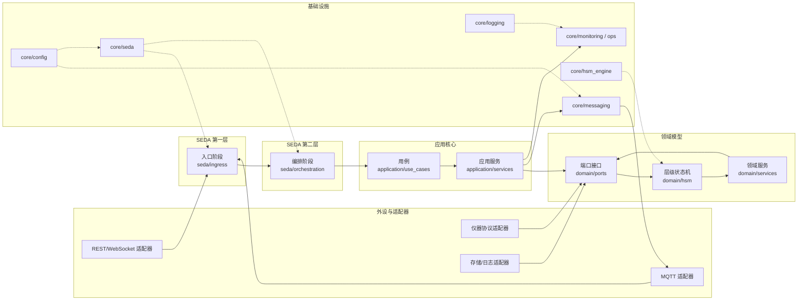

bus.subscribe("inst/#", handler)  # Matches all inst/* topics
🧩 六边形 + 双层 SEDA + HSM 的实验室仪器平台骨架

本项目将重构为一个围绕 MQTT 总线、六边形架构、双层 SEDA 队列与分层状态机（HSM）的实验室自动化平台。目标是以 LCR Meter 为首个接入设备，并通过虚拟诊断仪 Device TestBox 搭建测试沙箱，打造可扩展、可观测、可自愈的仪器控制底座。

🎯 愿景
- 以“命令 / 数据 / 事件”三通道将业务域与适配层完全解耦。
- 每台仪器作为 Actor 运行独立状态机，具备故障自愈与一等公民的可观测性。
- 双层 SEDA：MQTT 主题承担系统级阶段队列，进程内以 asyncio/线程安全队列细分职责，天然具备背压、限流与弹性扩展能力。
- 六边形架构确保 Domain、Ports、Adapters 分层清晰，上层编排与底层协议互不侵入。

📈 当前进度（2025-11-07）
- InstrumentHub 旧实现已彻底移除，仓库以 YLabCore 六边形骨架运行。
- README 已更新为当前架构说明，并收录愿景、架构图与路线图。
- 目录骨架完善：`configs/、schemas/、infra/、core/、adapters/、apps/、scripts/、tools/` 等模块全部到位。
- Device TestBox 虚拟仪器完成领域模型、JSON Schema、`DeviceTestBoxFakeDriver`，并通过 `devices/testbox/apps` Actor/队列串联形成可运行 demo。
- MQTT 命令/遥测/状态适配器已收敛到 `devices/testbox/drivers/`，新增针对适配器的单元测试，CI 继续运行 `pytest`。
- LCR 用例的领域模型与 Schema 已建立，占位代码等待驱动与 Actor 闭环。

🗒️ 近期待办
- 联调 Device TestBox MQTT 模式：对接 Mosquitto/EMQX，补充心跳与遗嘱主题。
- 细化 `core/domain` 与 `core/ports` 接口定义，使 LCR 与 TestBox 共用一致的命令/事件抽象。
- 编写领域模型与 JSON Schema 同步校验测试，避免契约漂移。
- 为 LCR 设备补齐驱动/Actor 与 MQTT 适配器闭环，纳入测试与 CI。
- 引入格式化与静态分析工具（例如 Ruff、mypy）纳入 CI。

🧠 目标架构


🚀 落地路线图
1. **骨架初始化（当前）**
   - 重写 README，明确愿景与计划。
   - 建立目录骨架与空文件，确保模块边界清晰。
   - 配置基础工具（`pyproject.toml`、`uv`、格式化约定）。
2. **领域与契约**
   - 定义 LCR Actor 的 HSM（INIT/IDLE/BUSY/ERROR 等）。
   - 补全 `core/domain/device_lcr/*`、`core/ports/*` 接口定义。
   - 在 `apps/devices/lcr/schemas/` 下完善命令、遥测、状态影子的 JSON Schema，并同步 Pydantic 模型。
3. **MQTT & 基础设施**
   - 完成设备级 MQTT 适配器（命令/遥测/状态影子）与连接管理。
   - 在 `infra/docker-compose.yml` 中提供 EMQX/Mosquitto、Influx、Grafana、MinIO 的一键环境。
   - 落地 `configs/*` 与 `.env`，确保配置即代码。
4. **设备 Actor（LCR meter）**
   - 实现 `apps/devices/lcr/drivers/device_lcr.py` 中的真实/虚拟驱动。
   - `apps/devices/lcr/transport/serial_transport.py` 负责串口/USB 通讯，支持重连与读写超时。
   - `apps/devices/lcr/*` 组合成“命令队列→驱动→遥测批处理→状态影子”的内层 SEDA。
5. **编排与用例**
   - 在 `apps/orchestrator/` 中实现流程驱动，支持 Saga、超时、补偿。
   - 通过 `apps/devices/lcr/domain/models.py` 提供标准化命令/事件模型。
   - `apps/persistor/` 完成遥测批量写入 Influx/Timescale。
6. **可观测性与运维**
   - 接入 Prometheus 指标、Grafana Dashboard，覆盖队列长度、吞吐、错误率。
   - 提供 `scripts/seed_mqtt.ps1`、`scripts/replay_telemetry.py` 等运维脚本。
   - 完成 ACL/TLS 样例、健康检查、LWT 配置。
7. **测试体系**
   - `tests/test_parser_scpi.py`、`tests/test_driver_lcr.py`、`tests/test_actions_sweep.py`、`tests/test_mqtt_contracts.py` 覆盖解析、驱动、领域逻辑与消息契约。
   - 引入 CI（GitHub Actions）运行单测与风格检查。
8. **扩展与硬化**
   - 增加第二台设备（如温控器），验证架构扩展性。
   - 针对错误注入、断电恢复编写自动化回归。
   - 完成文档与示例 Notebook/REST Demo。

📁 当前目录结构（节选）
```
configs/
core/
   domain/
      shared/
   policies/
   ports/
apps/
   devices/
      testbox/
         apps/
         domain/
         drivers/
         parsers/
         schemas/
         transport/
   orchestrator/
   persistor/
docs/
infra/
   docker-compose.yml
   grafana/
scripts/
tests/
tools/
```

🧪 开发约定
- 使用 Python 3.11+ 与 `uv` 驱动虚拟环境与依赖管理。
- 采取 `src` 级打包思路，每个包均显式 `__init__.py`，并使用类型标注。
- 测试框架为 `pytest`，并借助 `pytest-asyncio` 覆盖异步逻辑；合约测试使用 `jsonschema` 或 `pydantic`。
- MQTT 主题规范：`lab/<site>/<line>/<deviceType>/<deviceId>/<channel>/<verb>`，命令/遥测/事件互不混用。

📝 开发日志
- 2025-11-07：修复 demo JSON 序列化；`uv run --no-project python -m apps.devices.testbox.apps.main` 可输出完整诊断进度与完成事件。
- 2025-11-07：拆分 Device TestBox MQTT 适配器并补充命令/遥测单元测试；`uv sync` 支持安装打包后的 `ylabcore`。
- 2025-11-07：在本地 Mosquitto 上成功联调 TestBox MQTT 模式，命令→驱动→遥测→状态影子链路闭环。
- 2025-11-07：迁移 Device TestBox 代码至 `apps.devices.testbox` 包，测试布局同步调整并移除旧路径兼容层。

🚀 运行方式
- Demo：`uv run python -m apps.devices.testbox.apps.main`（无需 MQTT 依赖，直接输出诊断进度与完成事件）。
- MQTT 服务：
   1. 确保 `uv sync` 已安装依赖（含 `paho-mqtt`），并启动本地 broker（如 `mosquitto -v`）。
   2. 根据需要准备配置文件（可选）：

       ```json
       {
          "device_id": "TB-001",
          "mqtt": {
             "host": "localhost",
             "port": 1883,
             "base_topic": "lab/local/line/device_testbox/TB-001"
          }
       }
       ```

   3. 运行 `uv run python -m apps.devices.testbox.apps.main --mode mqtt --config path/to/config.json`。
- 遥测验证：订阅 `lab/local/line/device_testbox/TB-001/#`，可看到命令、遥测与状态影子主题消息。

⚙️ 环境准备（建议）
- Python 3.11 与 `uv`：`pip install uv`。
- 本地 MQTT Broker：Mosquitto 或 EMQX（使用 `infra/docker-compose.yml` 将提供一键环境）。
- 数据持久化：InfluxDB 2.x + Grafana（同样由 docker-compose 启动）。
- 推荐在 Windows 下通过 PowerShell + WSL2 混合环境使用；脚本提供 `.ps1` / `.py` 双版本。

📜 许可证

MIT License © 2025 CrazySoccerDude
