# Architecture Evolution: From YLabCore to LabYCore

## Current Architecture (YLabCore)

```mermaid
graph TB
    subgraph Orchestrator
        ORCH[TestBox Workflow]
    end
    
    subgraph MQTT Broker
        BROKER[Mosquitto]
    end
    
    subgraph Device TestBox
        CMD_ADAPTER[Command Adapter<br/>mqtt → queue]
        CMD_QUEUE[Command Queue]
        ACTOR[Actor<br/>• Command handler<br/>• Driver invocation<br/>• Progress tracking<br/>• Error handling]
        DRIVER[Driver<br/>Fake/Real]
        TELE_QUEUE[Telemetry Queue]
        TELE_ADAPTER[Telemetry Adapter<br/>queue → mqtt]
        STATE_ADAPTER[State Adapter<br/>Shadow Publisher]
        TRANSPORT[Serial Transport<br/>loop://]
    end
    
    ORCH -->|publish cmd| BROKER
    BROKER -->|subscribe cmd| CMD_ADAPTER
    CMD_ADAPTER --> CMD_QUEUE
    CMD_QUEUE --> ACTOR
    ACTOR --> DRIVER
    DRIVER --> TRANSPORT
    ACTOR --> TELE_QUEUE
    TELE_QUEUE --> TELE_ADAPTER
    TELE_ADAPTER -->|publish tele| BROKER
    TELE_ADAPTER --> STATE_ADAPTER
    STATE_ADAPTER -->|publish shadow| BROKER
    BROKER -->|subscribe tele| ORCH
```



### Characteristics
- **Monolithic Actor**: Handles command processing, driver calls, and telemetry emission
- **Implicit State**: State transitions inferred from telemetry events
- **No Scheduler**: Sequential command processing
- **Simple Queues**: Basic asyncio.Queue for commands and telemetry

---

## Target Architecture (LabYCore Vision)

```mermaid
graph TB
    subgraph Orchestrator
        ORCH[Experiment Runner]
    end
    
    subgraph MQTT Broker
        BROKER[Mosquitto]
    end
    
    subgraph Instrument Service
        INGRESS[Command Ingress<br/>• MQTT subscribe<br/>• Deserialize<br/>• Submit to scheduler]
        
        SCHEDULER[Scheduler<br/>• Priority queue<br/>• Route commands<br/>• Publish Ack: accepted<br/>• Create HSM tasks<br/>• Cancel support]
        
        HSM[Hierarchical State Machine<br/>• State: INIT/IDLE/BUSY/ERROR<br/>• Business logic<br/>• Driver calls<br/>• Publish Telemetry<br/>• Publish Ack: done/error<br/>• Trigger Shadow update]
        
        DRIVER[Driver<br/>• Hardware I/O only<br/>• Protocol translation<br/>• async/await]
        
        CMD_API[Command API<br/>• supported_ops()<br/>• op_params_schema()<br/>• route(cmd)]
        
        TELE_MOD[Telemetry Module<br/>• to_measure()<br/>• Data formatting]
        
        SHADOW_MOD[Shadow Module<br/>• build_shadow()<br/>• State snapshot]
        
        HEALTH[Health Monitor<br/>• Periodic metrics<br/>• Independent coroutine]
        
        subgraph Publishers
            ACK_PUB[Ack Publisher]
            TELE_PUB[Telemetry Publisher]
            SHADOW_PUB[Shadow Publisher]
            HEALTH_PUB[Health Publisher]
        end
        
        TRANSPORT[Serial Transport]
    end
    
    ORCH -->|Command| BROKER
    BROKER --> INGRESS
    INGRESS --> SCHEDULER
    SCHEDULER --> CMD_API
    CMD_API --> HSM
    SCHEDULER --> ACK_PUB
    HSM --> DRIVER
    DRIVER --> TRANSPORT
    HSM --> TELE_MOD
    TELE_MOD --> TELE_PUB
    HSM --> SHADOW_MOD
    SHADOW_MOD --> SHADOW_PUB
    HSM --> ACK_PUB
    HEALTH --> HEALTH_PUB
    ACK_PUB -->|Ack| BROKER
    TELE_PUB -->|Telemetry| BROKER
    SHADOW_PUB -->|Shadow| BROKER
    HEALTH_PUB -->|Health| BROKER
    BROKER -->|Telemetry| ORCH
```

### Characteristics
- **Layered Architecture**: Clear separation between ingestion, scheduling, execution
- **Explicit State Machine**: HSM manages state with guards and transitions
- **Dedicated Scheduler**: Priority queue, cancellation, task orchestration
- **Modular Publishers**: Each message type has dedicated publisher
- **Command API**: Dynamic routing and schema validation
- **Health Monitoring**: Independent health tracking with heartbeat

---

## Migration Path: 3-Phase Evolution

### Phase 1: Add Ack Layer (Minimal Disruption)

**Goal**: Introduce explicit acknowledgment without major refactoring

```mermaid
graph TB
    subgraph Device Current + Ack
        CMD_ADAPTER[Command Adapter]
        CMD_QUEUE[Command Queue]
        ACTOR[Actor<br/>+ Ack emission]
        DRIVER[Driver]
        TELE_QUEUE[Telemetry Queue]
        TELE_ADAPTER[Telemetry Adapter]
        STATE_ADAPTER[State Adapter]
        ACK_PUB[✨ NEW: Ack Publisher]
    end
    
    CMD_ADAPTER --> CMD_QUEUE
    CMD_QUEUE --> ACTOR
    ACTOR -->|accepted| ACK_PUB
    ACTOR --> DRIVER
    ACTOR -->|done/error| ACK_PUB
    ACTOR --> TELE_QUEUE
    TELE_QUEUE --> TELE_ADAPTER
```



**Changes**:
1. Add `core/domain/shared/ack.py` with Ack model
2. Add `apps/devices/testbox/adapters/ack_publisher.py`
3. Modify Actor to emit Acks at start and end of command handling
4. Update Orchestrator to listen for Acks

**Benefits**:
- Better observability
- Orchestrator can track command lifecycle
- Minimal code changes

---

### Phase 2: Extract HSM (Moderate Refactoring)

**Goal**: Separate state management from command handling


**Changes**:
1. Create `apps/devices/testbox/state_machine.py` with TestBoxHSM class
2. Move business logic from Actor to HSM
3. Actor becomes thin coordinator: get command → call HSM → handle result
4. HSM owns state transitions and driver interactions

**Benefits**:
- Single Responsibility Principle
- Testable state machine logic
- Reusable state patterns across devices
- Easier to add abort/cancel logic

---

### Phase 3: Add Scheduler (Full Architecture)

**Goal**: Complete the layered architecture with dedicated scheduler

```mermaid
graph TB
    subgraph Device Final Architecture
        CMD_ADAPTER[Command Ingress]
        SCHEDULER[✨ NEW: Scheduler<br/>• Priority queue<br/>• Route commands<br/>• Task management]
        CMD_API[✨ NEW: Command API<br/>• Route mapping<br/>• Schema validation]
        HSM[TestBox HSM]
        DRIVER[Driver]
        TELE_MOD[Telemetry Module]
        SHADOW_MOD[Shadow Module]
        HEALTH[✨ NEW: Health Monitor]
        ACK_PUB[Ack Publisher]
        TELE_PUB[Telemetry Publisher]
        SHADOW_PUB[Shadow Publisher]
        HEALTH_PUB[✨ NEW: Health Publisher]
    end
    
    CMD_ADAPTER --> SCHEDULER
    SCHEDULER --> CMD_API
    CMD_API --> HSM
    SCHEDULER --> ACK_PUB
    HSM --> DRIVER
    HSM --> TELE_MOD
    TELE_MOD --> TELE_PUB
    HSM --> SHADOW_MOD
    SHADOW_MOD --> SHADOW_PUB
    HEALTH --> HEALTH_PUB
```



**Changes**:
1. Create `apps/devices/testbox/scheduler.py` with priority queue
2. Create `apps/devices/testbox/command_api.py` for dynamic routing
3. Refactor Command Adapter to Command Ingress (submit to scheduler)
4. Add Health monitor with periodic publishing
5. Separate telemetry formatting from publishing

**Benefits**:
- Full LabYCore architecture
- Priority-based scheduling
- Cancellation support
- Command introspection
- Production-ready health monitoring

---

## Side-by-Side Comparison: Key Scenarios

### Scenario 1: Handling a Command

#### Current (YLabCore)
```python
# In Actor.run()
command = await self._command_queue.get_command()
payload = command.params.model_dump()
self._driver.start_task("run_diagnostic", payload)
await self._publish_progress(command)
await self._publish_done(command)
```

**Pros**: Simple, straightforward
**Cons**: No status tracking, no cancellation, sequential only

#### Target (LabYCore)
```python
# In CommandIngress
cmd = parse_mqtt_message(msg)
await scheduler.submit(cmd)  # Scheduler sends Ack: accepted

# In Scheduler.run()
cmd = await self.priority_queue.get()
method, args = command_api.route(cmd)
task = asyncio.create_task(method(command_id=cmd.id, **args))
self.running_tasks[cmd.id] = task

# In HSM.run_diagnostic()
self.set_state(BUSY)
await self.shadow_pub.publish(shadow.build_shadow(self.state))
for step in diagnostic_steps:
    result = await self.driver.execute(step)
    measure = telemetry.to_measure("diagnostic", result, cmd.id)
    await self.tele_pub.publish(measure)
self.set_state(IDLE)
await self.ack_pub.publish(cmd.id, "done", summary)
```

**Pros**: 
- Explicit status at each stage
- Cancellable via task handle
- Priority support
- Clear responsibility separation

---

### Scenario 2: Error Handling

#### Current (YLabCore)
```python
try:
    self._driver.start_task("run_diagnostic", payload)
    await self._publish_progress(command)
    await self._publish_done(command)
except Exception as exc:
    await self._telemetry_queue.put_telemetry(
        ErrorEvent(code="testbox.actor.error", message=str(exc))
    )
```

**Issues**: 
- No state update on error
- No Ack on error
- Error handling mixed with happy path

#### Target (LabYCore)
```python
# In HSM.run_diagnostic()
try:
    self.set_state(BUSY)
    # ... execution ...
    self.set_state(IDLE)
    await self.ack_pub.publish(cmd.id, "done", summary)
except DriverError as e:
    self.set_state(ERROR, error_info=e.info)
    await self.shadow_pub.publish(shadow.build_shadow(self.state))
    await self.ack_pub.publish(cmd.id, "error", details=e.info)
    # Optional: Trigger recovery logic
```

**Benefits**:
- State reflects error condition
- Orchestrator receives error Ack
- Shadow updated for monitoring
- Recovery logic can be added

---

### Scenario 3: Cancellation

#### Current (YLabCore)
```python
# In Actor
self._stop_event.set()  # Stops entire actor loop
# No per-command cancellation
```

**Issues**: 
- Can only stop entire actor
- No graceful command cancellation
- No acknowledgment of cancellation

#### Target (LabYCore)
```python
# In Scheduler.cancel(command_id)
if command_id in self.running_tasks:
    task = self.running_tasks[command_id]
    task.cancel()
    # HSM detects cancellation and cleans up
    
# In HSM
try:
    for step in long_operation:
        await asyncio.sleep(0)  # Cancellation point
        # ... work ...
except asyncio.CancelledError:
    self.set_state(IDLE)
    await self.ack_pub.publish(cmd.id, "cancelled")
    raise
```

**Benefits**:
- Per-command cancellation
- Graceful cleanup
- Orchestrator receives cancellation Ack
- Other commands continue processing

---

## Recommended Migration Timeline

### Week 1-2: Phase 1 (Ack Layer)
- [ ] Define Ack model
- [ ] Add Ack publisher
- [ ] Emit Acks in Actor
- [ ] Update Orchestrator to consume Acks
- [ ] Write tests

### Week 3-4: Phase 2 (Extract HSM)
- [ ] Design TestBoxHSM interface
- [ ] Implement state machine
- [ ] Migrate business logic from Actor to HSM
- [ ] Update Actor to coordinate HSM
- [ ] Write state machine tests
- [ ] Test error recovery scenarios

### Week 5-6: Phase 3 (Add Scheduler)
- [ ] Implement Scheduler with priority queue
- [ ] Create Command API router
- [ ] Implement cancellation support
- [ ] Add Health monitor
- [ ] Refactor adapters
- [ ] Integration tests
- [ ] Performance testing

### Week 7: Documentation & Polish
- [ ] Write architecture.md
- [ ] Write instrument_contract.md
- [ ] Update README with new architecture
- [ ] Create migration guide for new devices
- [ ] Performance optimization

---

## Success Criteria

### Phase 1 Complete When:
- ✅ Orchestrator receives Ack(accepted) within 100ms of command publish
- ✅ Orchestrator receives Ack(done/error) with correct status
- ✅ All existing tests pass
- ✅ New Ack integration test passes

### Phase 2 Complete When:
- ✅ HSM unit tests cover all state transitions
- ✅ Error recovery works correctly
- ✅ State machine logic is isolated from I/O
- ✅ Code coverage ≥ 80% for HSM module

### Phase 3 Complete When:
- ✅ Commands can be cancelled mid-execution
- ✅ Priority scheduling works (high-priority commands jump queue)
- ✅ Health heartbeat publishes every N seconds
- ✅ Command API can list all supported operations
- ✅ Full integration test suite passes

---

## Risk Mitigation

### Risk: Breaking Existing Functionality
**Mitigation**: 
- Keep existing tests passing at each phase
- Use feature flags to toggle new behavior
- Run both old and new paths in parallel initially

### Risk: Performance Degradation
**Mitigation**:
- Benchmark each phase
- Profile async task creation overhead
- Optimize hot paths (command routing, state transitions)

### Risk: Increased Complexity
**Mitigation**:
- Clear documentation at each layer
- Type hints and docstrings
- Architectural Decision Records (ADRs)
- Onboarding guide for new developers

---

## Conclusion

The evolution from YLabCore to LabYCore is a **refinement, not a rewrite**. Your current architecture has solid foundations:
- ✅ MQTT-based communication
- ✅ Actor pattern for device control
- ✅ Clean adapter separation
- ✅ Good test coverage

The proposed changes add:
- 🎯 **Better observability** (explicit Acks)
- 🎯 **Better maintainability** (separated concerns)
- 🎯 **Better scalability** (scheduler, priorities, cancellation)
- 🎯 **Production readiness** (health monitoring, error recovery)

By following the 3-phase migration plan, you can incrementally adopt the LabYCore architecture patterns while keeping the system functional at every step.
