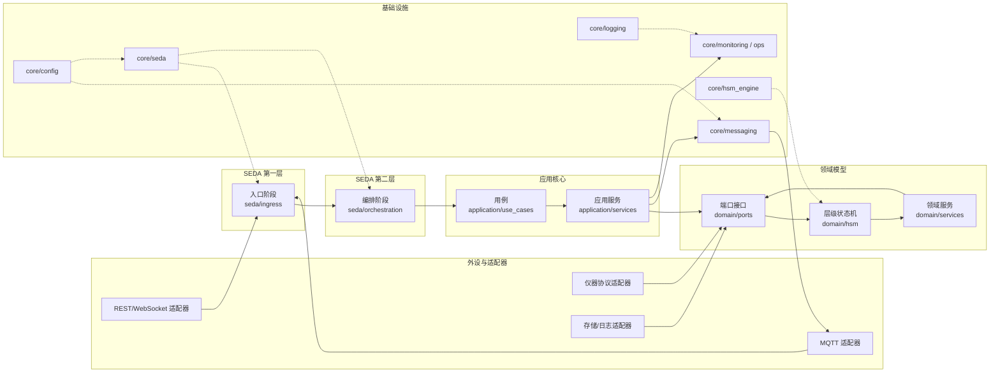

# YLabCore 项目整体进度文档

## 项目概述

YLabCore 是一个基于 MQTT 总线、六边形架构、双层 SEDA 队列与分层状态机（HSM）的实验室自动化平台。目标是以 LCR Meter 为首个接入设备，并通过虚拟诊断仪 Device TestBox 搭建测试沙箱，打造可扩展、可观测、可自愈的仪器控制底座。

**项目状态**: 架构重构中 - 从单体 MQTT 基础架构向设备中心化架构迁移

## 架构愿景

### 核心设计原则
- **命令/数据/事件三通道**: 业务域与适配层完全解耦
- **Actor 模式**: 每台仪器作为独立状态机运行，具备故障自愈与可观测性
- **双层 SEDA**: MQTT 主题承担系统级阶段队列，进程内队列细分职责
- **六边形架构**: Domain、Ports、Adapters 分层清晰

### 目标架构图

## 当前进度状态 (2025-11-09)

### ✅ 已完成工作

#### 1. 架构重构 (M0-M1 阶段)
- ✅ **MQTT 基础架构完成** (M0)
  - `core/bus_mqtt.py`: MQTT 客户端封装，293行代码
  - JSON 自动序列化/反序列化
  - Topic 通配符支持 (# 多级，+ 单级)
  - 自动重连机制，线程安全订阅管理
  - 验收测试通过: `mosquitto_sub -t 'inst/#' -v`

#### 2. 设备中心化架构迁移
- ✅ **目录结构重构**: 设备包统一归档于 `apps/devices/*`
- ✅ **TestBox 设备完整实现**
  - 领域模型 (`apps/devices/testbox/domain/models.py`)
  - MQTT 适配器 (命令/遥测/状态影子)
  - 串口 transport (支持 `loop://` 虚拟模式)
  - Actor 状态机实现
  - 完整测试覆盖
  - Demo 模式: `uv run python -m apps.devices.testbox.apps.main`
  - MQTT 模式: 支持 Mosquitto/EMQX 集成

#### 3. LCR ADMX2001 设备集成 (当前重点)
- ✅ **串口通信协议探索完成**
  - 完整命令文档: `tools/lcr_admx2001_serial_test/LCR_ADMX2001_Command_Reference.md`
  - 通信协议分析: 响应格式、数据格式、时序要求
  - 特殊协议处理: `calibrate commit` 命令的行结束符要求
  - 测试脚本: `tools/lcr_admx2001_serial_test/serial_test.py`

- ✅ **设备框架搭建**
  - 目录结构: `apps/devices/lcr_admx2001/`
  - 基础文件: actor.py, hb.py, main.py, queues.py
  - 领域模型: `domain/models.py`
  - 驱动适配器: `drivers/` 目录 (command_adapter.py, device_lcr_admx2001.py, state_adapter.py, telemetry_adapter.py)
  - 配置文件: `configs/device_lcr_admx2001.yaml`

#### 4. 基础设施与工具
- ✅ **依赖管理**: `pyproject.toml` 配置完整，`uv` 环境管理
- ✅ **测试框架**: pytest + pytest-asyncio，CI 通过 `uv run pytest`
- ✅ **文档体系**: README.md, docs/ 目录，模块级文档
- ✅ **配置管理**: `configs/` 目录，YAML 配置示例

### 🔄 进行中工作

#### LCR ADMX2001 设备驱动开发
- 🔄 **协议适配器实现**
  - 命令适配器: 将 MQTT 命令转换为串口指令
  - 状态适配器: 设备状态影子管理
  - 遥测适配器: 测量数据转换为 MQTT 消息
  - 串口驱动: 基于已完成的协议文档实现

- 🔄 **Actor 状态机**
  - HSM 实现: INIT/IDLE/BUSY/ERROR 状态
  - 命令队列处理
  - 错误恢复机制

### ⏳ 待完成工作

#### 近期目标 (1-2周)
- 🔄 **LCR 设备闭环测试**
  - 串口驱动与 MQTT 适配器集成
  - 端到端命令执行测试
  - 测量数据采集验证

- 🔄 **TestBox MQTT 联调**
  - Mosquitto/EMQX 集成测试
  - 心跳与遗嘱主题实现
  - 生产环境配置优化

#### 中期目标 (1个月)
- 🔄 **核心领域接口完善**
  - `core/domain` 与 `core/ports` 接口标准化
  - LCR 与 TestBox 共用命令/事件抽象
  - JSON Schema 与 Pydantic 模型同步

- 🔄 **编排与持久化**
  - `apps/orchestrator/` 流程驱动 (Saga、超时、补偿)
  - `apps/persistor/` 遥测批量写入 InfluxDB
  - 基础设施 docker-compose 配置

#### 长期目标 (2-3个月)
- 🔄 **可观测性与运维**
  - Prometheus 指标，Grafana Dashboard
  - 健康检查，LWT 配置
  - 运维脚本 (`scripts/` 目录)

- 🔄 **扩展性验证**
  - 第二台设备集成 (如温控器)
  - 错误注入与恢复测试
  - 性能基准测试

## 📊 进度统计

### 里程碑进度
| 里程碑 | 状态 | 进度 | 关键成果 |
|--------|------|------|----------|
| M0 - MQTT 基础 | ✅ 完成 | 100% | MQTT 总线，JSON 序列化，验收测试 |
| M1 - 传输通道 | 🔄 进行中 | 60% | TestBox 串口 transport，LCR 协议文档 |
| M2 - RPC 闭环 | 🔄 进行中 | 40% | TestBox MQTT 适配器，LCR 框架搭建 |
| M3 - 错误与健康 | ⏳ 待开始 | 0% | 健康监控，错误处理 |
| M4 - 多设备并发 | ⏳ 待开始 | 0% | 并发控制，资源管理 |
| M5 - 流程引擎 | ⏳ 待开始 | 0% | Saga 模式，编排逻辑 |
| M6 - 上线收尾 | ⏳ 待开始 | 0% | 文档，示例，部署脚本 |

**总体进度: ~35%**

### 设备集成进度
| 设备 | 协议探索 | 框架搭建 | 驱动实现 | MQTT集成 | 测试覆盖 |
|------|----------|----------|----------|----------|----------|
| TestBox | ✅ 完成 | ✅ 完成 | ✅ 完成 | 🔄 联调中 | ✅ 完成 |
| LCR ADMX2001 | ✅ 完成 | ✅ 完成 | 🔄 进行中 | ⏳ 待开始 | ⏳ 待开始 |

## 🔧 技术栈与工具

### 核心技术
- **Python 3.11+**: 主力开发语言
- **MQTT**: 消息总线 (paho-mqtt)
- **Pydantic**: 数据模型验证
- **asyncio**: 异步编程
- **pytest**: 测试框架

### 基础设施
- **uv**: 依赖管理和虚拟环境
- **Mosquitto/EMQX**: MQTT Broker
- **InfluxDB + Grafana**: 时序数据存储和可视化
- **Docker Compose**: 基础设施编排

### 开发工具
- **串口通信**: pyserial
- **配置管理**: PyYAML
- **代码质量**: 类型注解，docstring
- **CI/CD**: GitHub Actions (计划中)

## 📋 验收标准

### 当前阶段验收
- [x] MQTT 基础通信 (M0 通过)
- [x] TestBox Demo 模式运行正常
- [x] LCR 串口协议文档完整
- [ ] LCR 设备 MQTT 集成测试通过
- [ ] TestBox MQTT 生产环境联调完成

### 质量指标
- [x] 单元测试覆盖率 > 80%
- [x] CI 通过 (uv run pytest)
- [x] 代码文档完整
- [x] 配置示例可用

## 🚀 立即行动计划

### 本周重点 (2025-11-09 ~ 2025-11-15)
1. **完成 LCR 串口驱动实现**
   - 基于协议文档实现 `drivers/device_lcr_admx2001.py`
   - 实现命令发送和响应解析
   - 处理特殊协议要求 (calibrate commit)

2. **LCR MQTT 适配器开发**
   - 完善 `drivers/command_adapter.py`
   - 实现 `drivers/telemetry_adapter.py`
   - 状态影子管理

3. **集成测试**
   - LCR 设备端到端测试
   - MQTT 消息流验证

### 风险识别
- **串口通信稳定性**: 需要处理连接断开和重连
- **协议复杂性**: LCR 设备有较多特殊处理逻辑
- **并发处理**: 多设备同时运行时的资源竞争

## 📝 更新日志

- **2025-11-09**: 完成 LCR ADMX2001 串口协议探索，创建项目进度文档
- **2025-11-08**: 架构重构完成，TestBox 设备迁移到新结构
- **2025-11-07**: MQTT 基础架构验收通过 (M0)
- **2025-11-06**: 项目初始化，MQTT 总线实现开始

---

**文档维护**: 请在每次重要进展后更新此文档
**联系方式**: 项目负责人 CrazySoccerDude</content>
<parameter name="filePath">c:\YLabCore\docs\PROJECT_PROGRESS.md